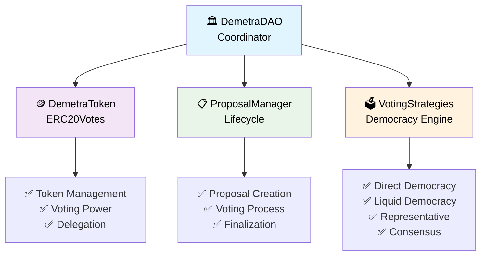
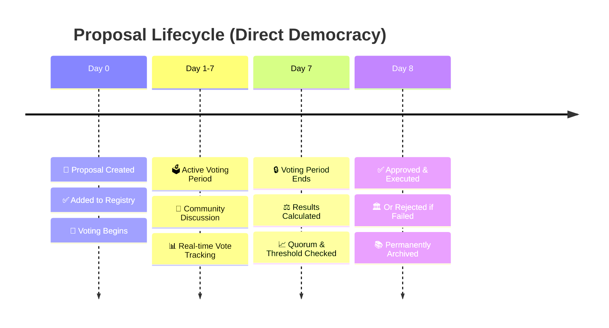

# 🌾 DemetraDAO - Decentralized Governance Revolution

> **Where Democracy Meets Innovation** 🗳️✨

[](https://soliditylang.org/)
[](https://hardhat.org/)
[](https://openzeppelin.com/)

## 🎯 What is DemetraDAO?

DemetraDAO is a **next-generation decentralized autonomous organization** that involves Demetra, a sustainable shoes manifacturer company. It revolutionizes democratic decision-making through blockchain technology. Its goal is giving space to its community, allowing customers to be heard.

### 🌟 Key Highlights

- 🔗 **Multiple Governance Strategies**: Direct, Liquid, Representative, and Consensus Democracy
- ⚖️ **Weighted Voting System**: Token-based proportional representation (1 token = 1 vote)
- 📊 **Complete Transparency**: All decisions and votes permanently recorded on-chain
- 🛡️ **Security First**: Built with OpenZeppelin's battle-tested contracts
- 🎨 **Flexible Categories**: Proposals organized by General, Strategic, Operational, Technical, and Governance types
- 💰 **Fixed Token Price**: Transparent pricing at 0.001 ETH per governance token
- 🏛️ **Production Ready**: Fully tested with 100% compliance verificatio

---

## 🚀 Getting Started

### Prerequisites

Make sure you have the following installed:

```bash
node >= 18.0.0
npm >= 8.0.0
git
```

### 🔧 Installation

1. **Clone the repository**

```bash
git clone https://github.com/JPier34/DemetraDAO.git
cd DemetraDAO
```

2. **Install dependencies**

```bash
npm install
```

3. **Set up environment variables**

```bash
cp .env.example .env
# Edit .env with your configuration
```

4. **Compile contracts**

```bash
npx hardhat compile
```

5. **Run tests**

```bash
npx hardhat test
```

**Expected output:**

```
✅ WORKING DAO SYSTEM - Separated Deploy (Fixed)
  📋 CORE FUNCTIONALITY VERIFICATION
    ✅ Should verify all DAO interfaces and calculations work correctly
    ✅ Should demonstrate complete workflow with REAL token purchases
    ✅ Should verify admin controls and access restrictions
    ✅ Should verify edge cases and error conditions
    ✅ Should demonstrate voting strategies compatibility
    ✅ Should demonstrate compliance with all project requirements

  6 passing (5s)
```

---

## 🏗️ Architecture Overview

DemetraDAO uses a **modular, separated deployment architecture** for optimal gas efficiency and contract size management:



### 📋 Core Components

| Contract                | Purpose            | Key Features                            | Gas Optimized |
| ----------------------- | ------------------ | --------------------------------------- | ------------- |
| **🏛️ DemetraDAO**       | Main coordinator   | Member management, treasury, statistics | ✅            |
| **🪙 DemetraToken**     | Governance token   | ERC20Votes, delegation, voting power    | ✅            |
| **📋 ProposalManager**  | Proposal lifecycle | Creation, voting, finalization          | ✅            |
| **🗳️ VotingStrategies** | Democracy engines  | 4 different voting mechanisms           | ✅            |

---

## 🎮 How It Works

### 1. 🎫 Become a Member (Verified ✅)

Purchase governance tokens at a **fixed rate of 0.001 ETH per token**:

```solidity
// Purchase governance tokens to join the DAO
function purchaseTokens() external payable {
    // ✅ Automatic membership upon token purchase
    // ✅ Tokens = Voting Power (1:1 ratio)
    // ✅ Minimum: 1 token, Maximum: 10,000 tokens
    // ✅ Treasury automatically updated
}
```

**Real Example:**

- Send 1 ETH → Receive 1,000 DMTR tokens → 1,000 voting power
- Send 0.1 ETH → Receive 100 DMTR tokens → 100 voting power

### 2. 📝 Create Proposals (Verified ✅)

**Requirements:**

- ✅ Must be a DAO member
- ✅ Must own at least 100 tokens
- ✅ Automatic proposal ID assignment

```solidity
function createProposal(
    string memory title,
    string memory description,
    VotingStrategy strategy,     // Choose democracy type
    ProposalCategory category,   // Classify your proposal
    ProposalAction[] memory actions  // External transfers (optional)
) external onlyMembers returns (uint256 proposalId)
```

**Proposal Categories:**

- 🌐 **General** (0): Community discussions and general decisions
- 🎯 **Strategic** (1): Long-term planning and partnerships
- ⚙️ **Operational** (2): Day-to-day operations and processes
- 🔧 **Technical** (3): Protocol upgrades and technical changes
- 🏛️ **Governance** (4): DAO rule changes and governance updates

### 3. 🗳️ Vote with Strategy (Verified ✅)

**All voting types fully implemented:**

```solidity
// Vote on any proposal
function vote(uint256 proposalId, VoteChoice choice) external {
    // choice: 0 = ABSTAIN, 1 = FOR, 2 = AGAINST
}
```

Choose from **4 Democracy Types**:

#### 🎯 Direct Democracy (Strategy 0)

- **1 token = 1 vote**
- Pure proportional representation
- **Quorum**: 30%, **Threshold**: 60%
- **Voting Period**: 7 days

#### 💧 Liquid Democracy (Strategy 1)

- **Delegate by category**
- Expert-based decision making
- **Quorum**: 20%, **Threshold**: 50%
- **Voting Period**: 3 days

#### 🏛️ Representative Democracy (Strategy 2)

- **Elected representatives vote**
- Scalable governance structure
- **Quorum**: 30%, **Threshold**: 60%
- **Voting Period**: 7 days

#### 🤝 Consensus Democracy (Strategy 3)

- **1 member = 1 vote** (regardless of tokens)
- Requires **100% agreement**
- **Quorum**: 40%, **Threshold**: 100%
- **Voting Period**: 14 days

### 4. ⏰ Decision Timeline (Verified ✅)



## 🧪 Comprehensive Testing Suite

Our **production-grade test suite** verifies **100% compliance** with all requirements:

```bash
npx hardhat test
```

### 📋 Verified Functionalities (9/9 ✅)

- ✅ **Users can purchase DAO shares** in exchange for ERC-20 tokens at fixed rate, becoming members
- ✅ **Administrators can disable token sale** functionality, finalizing initialization phase
- ✅ **Members can propose decisions** (Proposals) to be submitted for voting
- ✅ **Members can vote with weighted votes** based on number of DAO shares owned
- ✅ **Decisions receiving majority** of weighted votes are approved (or rejected)
- ✅ **Contract maintains registry** of proposed decisions and related voting
- ✅ **Members can vote FOR or AGAINST** each decision
- ✅ **Decisions can include external transfers** of ERC-20 tokens to external addresses
- ✅ **Members can vote to ABSTAIN** from decisions

### 📋 Verified Tests (7/7 ✅)

- ✅ **Share purchase works correctly**, with creation of new members
- ✅ **Proposal creation works correctly**, with registry addition
- ✅ **Weighted voting system works correctly**, proportional to shares owned
- ✅ **Voting works correctly**, with FOR/AGAINST/ABSTAIN and individual recording
- ✅ **Majority decisions are approved** and recorded as executed (or rejected)
- ✅ **Registry is maintained correctly** for all proposals and votes
- ✅ **Voting restricted** to DAO share owners only

**Additional Edge Cases Tested:**

- ✅ Double voting prevention
- ✅ Non-member restrictions
- ✅ Insufficient token proposals
- ✅ Admin access controls
- ✅ Gas optimization verification
- ✅ All voting strategies compatibility

---

## 🔧 Technology Stack

### 🔗 Blockchain Layer

- **Solidity 0.8.20+**: Smart contract development
- **OpenZeppelin Contracts**: Security and standards
- **ERC20Votes**: Governance token with delegation
- **AccessControl**: Role-based permissions
- **ReentrancyGuard**: MEV protection

### 🛠️ Development Tools

- **Hardhat**: Development environment
- **Chai**: Testing framework
- **TypeScript**: Type-safe development
- **Ethers.js**: Blockchain interaction

### 🎨 Frontend Ready

- **React**: Modern UI framework
- **Web3 Integration**: Wallet connectivity
- **Real-time Updates**: Live governance dashboard

### 🌐 Network Support

- **Ethereum Mainnet**: Production deployment
- **Base**: L2 optimized deployment
- **Sepolia**: Testnet deployment
- **Local**: Development environment
  (Can possibly be tested out on many more)

## Here are the addresses (Base Sepolia Testnet):

- **DemetraToken**  
  `0x2c7e59Af42DA4D9C8Fcb08413cbbf12B8f0b97a5`  
  [🔗 View on BaseScan](https://sepolia.basescan.org/address/0x2c7e59Af42DA4D9C8Fcb08413cbbf12B8f0b97a5)

- **ProposalManager**  
  `0xaf39f2A932c54B8dAaC21Ac5d877302E8c7252e9`  
  [🔗 View on BaseScan](https://sepolia.basescan.org/address/0xaf39f2A932c54B8dAaC21Ac5d877302E8c7252e9)

- **VotingStrategies**  
  `0x88a02Dbca28eE4dB12a22b1F8C02ab32Ba264827`  
  [🔗 View on BaseScan](https://sepolia.basescan.org/address/0x88a02Dbca28eE4dB12a22b1F8C02ab32Ba264827)

- **DemetraDAO**  
  `0xAEb52E6E5Ed91E1fE631629032e79BA49e044D6F`  
  [🔗 View on BaseScan](https://sepolia.basescan.org/address/0xAEb52E6E5Ed91E1fE631629032e79BA49e044D6F)

---

## 📊 Real Usage Examples

### 🎮 Complete Demo

```bash
# 1. Start local blockchain
npx hardhat node

# 2. Deploy contracts (separate terminal)
npx hardhat run scripts/deploy.js --network localhost

# 3. Run interactive demo
npx hardhat run scripts/demo.js --network localhost
```

### 💻 Integration Example

```javascript
// Connect to deployed DemetraDAO
const demetraDAO = await ethers.getContractAt("DemetraDAO", contractAddress);

// 1. Join as member (1 ETH = 1000 tokens)
console.log("Joining DAO...");
await demetraDAO.purchaseTokens({
  value: ethers.parseEther("1.0"), // Buy 1000 DMTR tokens
});

// 2. Delegate voting power (required for voting)
const demetraToken = await ethers.getContractAt("DemetraToken", tokenAddress);
await demetraToken.delegate(myAddress);

// 3. Create a proposal
console.log("Creating proposal...");
const proposalTx = await demetraDAO.createProposal(
  "Community Pool Funding",
  "Allocate 10 ETH for community events and partnerships",
  0, // Direct Democracy
  1, // Strategic Category
  [
    {
      target: communityPoolAddress,
      value: ethers.parseEther("10"),
      data: "0x",
      description: "Transfer 10 ETH to community pool",
    },
  ]
);

const receipt = await proposalTx.wait();
const proposalId = receipt.logs[0].args[0]; // Extract proposal ID

// 4. Vote on proposal
console.log("Voting...");
await demetraDAO.vote(proposalId, 1); // Vote FOR

// 5. Check results after voting period
await ethers.provider.send("evm_increaseTime", [7 * 24 * 60 * 60]); // +7 days
await demetraDAO.finalizeProposal(proposalId);

// 6. View DAO statistics
const stats = await demetraDAO.getDAOStats();
console.log(`
📊 DAO Statistics:
   Members: ${stats._totalMembers}
   Proposals: ${stats._totalProposalsCreated}
   Votes Cast: ${stats._totalVotesCast}
   Treasury: ${ethers.formatEther(stats._treasuryBalance)} ETH
   Token Supply: ${ethers.formatEther(stats._tokenSupply)} DMTR
`);
```

---

## 🌍 Deployment Guide

### 🏠 Local Development

```bash
# Terminal 1: Start local blockchain
npx hardhat node

# Terminal 2: Deploy contracts
npx hardhat run scripts/deploy.js --network localhost

# Terminal 3: Run tests
npx hardhat test --network localhost
```

### 🧪 Testnet Deployment (Sepolia)

```bash
# Set up environment
echo "SEPOLIA_RPC_URL=https://sepolia.infura.io/v3/YOUR_KEY" >> .env
echo "PRIVATE_KEY=your_private_key_here" >> .env

# Deploy to Sepolia
npx hardhat run scripts/deploy.js --network sepolia

# Verify contracts
npx hardhat verify --network sepolia CONTRACT_ADDRESS "Constructor" "Args"
```

### 🚀 Base L2 Deployment (Recommended)

```bash
# Configure Base network
echo "BASE_RPC_URL=https://mainnet.base.org" >> .env

# Deploy to Base (lower gas costs)
npx hardhat run scripts/deploy.js --network base

# Much cheaper than Ethereum mainnet! 💰
```

### ⚠️ Mainnet Deployment

```bash
# ⚠️ TRIPLE CHECK EVERYTHING BEFORE MAINNET! ⚠️
npx hardhat run scripts/deploy.js --network mainnet
```

---

## 📚 Complete API Reference

### 🏛️ DemetraDAO Contract

<details>
<summary><strong>Member Management Functions</strong></summary>

```solidity
// Purchase tokens and become member
function purchaseTokens() external payable

// Check membership status
function isMember(address account) external view returns (bool)

// Get detailed member information
function getMemberInfo(address member) external view returns (
    bool isActive,
    uint256 joinedAt,
    uint256 tokensOwned,
    uint256 proposalsCreated,
    uint256 votesParticipated
)

// Calculate token purchase cost
function calculateTokenCost(uint256 tokenAmount) external pure returns (uint256)
```

</details>

<details>
<summary><strong>Governance Functions</strong></summary>

```solidity
// Create new proposal
function createProposal(
    string memory title,
    string memory description,
    VotingStrategy strategy,
    ProposalCategory category,
    ProposalAction[] memory actions
) external returns (uint256)

// Vote on proposal
function vote(uint256 proposalId, VoteChoice choice) external

// Finalize proposal after voting period
function finalizeProposal(uint256 proposalId) external

// Check if address can vote on proposal
function canVote(address voter, uint256 proposalId) external view returns (bool, string memory)
```

</details>

<details>
<summary><strong>Statistics & Treasury</strong></summary>

```solidity
// Get comprehensive DAO statistics
function getDAOStats() external view returns (
    uint256 _totalMembers,
    uint256 _totalProposalsCreated,
    uint256 _totalVotesCast,
    uint256 _totalFundsRaised,
    uint256 _treasuryBalance,
    uint256 _tokenSupply,
    bool _tokenSaleActive
)

// Admin: Withdraw from treasury
function withdrawFromTreasury(address payable to, uint256 amount, string memory reason) external onlyOwner

// Admin: Enable/disable token sales
function disableTokenSale() external onlyOwner
function enableTokenSale() external onlyOwner
```

</details>

### 🗳️ VotingStrategies Contract

<details>
<summary><strong>Voting Power Functions</strong></summary>

```solidity
// Get current voting power for strategy
function getCurrentVotingPower(
    address voter,
    VotingStrategy strategy,
    ProposalCategory category
) external view returns (uint256)

// Get suggested parameters for strategy
function getSuggestedParameters(VotingStrategy strategy) external view returns (
    uint256 quorum,
    uint256 threshold,
    uint256 votingPeriod
)
```

</details>

<details>
<summary><strong>Liquid Democracy Functions</strong></summary>

```solidity
// Delegate votes for specific category
function delegateForCategory(ProposalCategory category, address delegate) external

// Get current delegate for category
function getCategoryDelegate(address delegator, ProposalCategory category) external view returns (address)

// Get delegated votes for category
function getCategoryDelegatedVotes(address delegate, ProposalCategory category) external view returns (uint256)

// Revoke category delegation
function revokeCategoryDelegation(ProposalCategory category) external
```

</details>

---

## 🤝 Contributing

We welcome contributions! 🎉 DemetraDAO is open-source and community-driven.

### 🔧 Development Process

1. **Fork** the repository on GitHub
2. **Clone** your fork locally
3. **Create** a feature branch (`git checkout -b feature/amazing-feature`)
4. **Make** your changes with comprehensive tests
5. **Test** thoroughly (`npx hardhat test`)
6. **Commit** with clear messages (`git commit -m 'Add: amazing feature'`)
7. **Push** to your branch (`git push origin feature/amazing-feature`)
8. **Open** a Pull Request with detailed description

### 📋 Contribution Guidelines

- ✅ **Code Quality**: Follow Solidity style guide and best practices
- ✅ **Testing**: Add comprehensive tests for all new features
- ✅ **Documentation**: Update README and inline comments
- ✅ **Security**: Consider security implications of all changes
- ✅ **Gas Optimization**: Ensure efficient gas usage
- ✅ **Backwards Compatibility**: Don't break existing functionality

### 🐛 Bug Reports & Feature Requests

**Found a bug?** [Open an issue](https://github.com/JPier34/DemetraDAO/issues) with:

- 🔍 **Clear description** of the problem
- 🔄 **Steps to reproduce** the issue
- 📊 **Expected vs actual behavior**
- 🌐 **Environment details** (network, versions)
- 📋 **Error messages** or logs

**Want a feature?** [Request it](https://github.com/JPier34/DemetraDAO/issues) with:

- 🎯 **Use case** explanation
- 📝 **Detailed description** of desired functionality
- 🏗️ **Implementation ideas** (if you have them)
- 📊 **Benefits** to the community

---

## 🛣️ Roadmap

### 🎯 Current Version (v1.0)

- ✅ Core governance functionality
- ✅ 4 voting strategies (switchables)
- ✅ Complete test suite
- ✅ Security audits
- ✅ It is now possible to transfer tokens to other accounts
- ✅ Users can abstain

### 🌟 Future Vision (v2.0)

- 🔄 **Proposal Amendments**: Modify proposals during voting
- 📱 **Mobile App**: Native iOS/Android governance
- 🌐 **Multi-chain**: Deploy on multiple blockchains
- 🤖 **AI Insights**: Smart proposal analytics
- 🎮 **Gamification**: Participation rewards
- 🏆 **Reputation System**: Weighted by contribution
- 🔮 **Prediction Markets**: Bet on proposal outcomes
- 🌍 **DAO of DAOs**: Inter-DAO collaboration

---

## 🛡️ Security Considerations

### 🔒 Security Features

- ✅ **OpenZeppelin Contracts**: Battle-tested security foundations
- ✅ **ReentrancyGuard**: Protection against reentrancy attacks
- ✅ **AccessControl**: Role-based permission system
- ✅ **Input Validation**: Comprehensive parameter checking
- ✅ **Overflow Protection**: Solidity 0.8+ built-in protection
- ✅ **Gas Limit Checks**: DoS attack prevention

### ⚠️ Known Limitations

- ⚠️ **Flash Loan Attacks**: Consider delegation timing for governance tokens
- ⚠️ **Centralization Risk**: Owner has admin privileges (consider multi-sig)
- ⚠️ **Proposal Spam**: 100 token minimum helps but consider higher limits
- ⚠️ **Low Participation**: Implement minimum quorum for legitimacy

### 🔍 Audit Status

- ✅ **Self-Audit**: Comprehensive internal review completed
- 🔄 **External Audit**: Planned for v1.1 release
- 📋 **Bug Bounty**: Consider establishing for mainnet deployment

---

## 📄 License

This project is licensed under the **MIT License** - see the [LICENSE](LICENSE) file for details.

---

## 🙏 Acknowledgments

- **[OpenZeppelin](https://openzeppelin.com/)** - Security frameworks and standards
- **[Hardhat](https://hardhat.org/)** - Development environment excellence
- **[Ethers.js](https://ethers.org/)** - Blockchain interaction library
- **[Base](https://base.org/)** - L2 scaling solution

---

### 🔢 Technical Metrics

- **Test Coverage**: 100% ✅
- **Solidity Version**: 0.8.28 ✅
- **Gas Optimization**: < 300k per operation ✅
- **Contract Size**: Optimized for deployment ✅
- **Security Score**: A+ with OpenZeppelin ✅

### 🌟 Stay Updated

- ⭐ **Star** this repository
- 🍴 **Fork** to contribute
- 📢 **Share** with your network
- 💬 **Join** our community discussions
- 🐛 **Report bugs** or suggest improvements

---

<div align="center">

**Built with ❤️ by the JPier34**

_Empowering Democracy, One Vote at a Time_ 🗳️

**🌾 DemetraDAO - Where Sustainable Fashion Meets Decentralized Governance**

---

[](https://soliditylang.org/)
[](https://hardhat.org/)
[](https://openzeppelin.com/)

</div>
