# Sample Hardhat Project

This project demonstrates a basic Hardhat use case. It comes with a sample contract, a test for that contract, and a Hardhat Ignition module that deploys that contract.

Try running some of the following tasks:

````shell
npx hardhat help
npx hardhat test
REPORT_GAS=true npx hardhat test
npx hardhat node
npx hardhat ignition deploy ./ignition/modules/Lock.ts
```# 🌾 DemetraDAO - Decentralized Governance Revolution

> **Where Democracy Meets Innovation** 🗳️✨

[](https://soliditylang.org/)
[](https://hardhat.org/)
[](https://openzeppelin.com/)

## 🎯 What is DemetraDAO?

DemetraDAO is a **next-generation decentralized autonomous organization** that involves Demetra, a sustainable shoes manifacturer company. It revolutionizes democratic decision-making through blockchain technology. Its goal is giving space to its community, allowing customers to be heard.

### 🌟 Key Highlights

- 🔗 **Multiple Governance Strategies**: Direct, Liquid, Representative, and Consensus Democracy (already tested)
- ⚖️ **Weighted Voting System**: Token-based proportional representation
- 📊 **Complete Transparency**: All decisions and votes permanently recorded on-chain
- 🛡️ **Security First**: Built with OpenZeppelin's battle-tested contracts
- 🎨 **Flexible Categories**: Proposals organized by General, Strategic, Operational, Technical, and Governance types

---

## 🚀 Getting Started

### Prerequisites

Make sure you have the following installed:

```bash
node >= 18.0.0
npm >= 8.0.0
git
````

### 🔧 Installation

1. **Clone the repository**

```bash
git clone https://github.com/JPier34/DemetraDAO.git
cd DemetraDAO
```

2. **Install dependencies**

```bash
npm install
```

4. **Compile contracts**

```bash
npx hardhat compile
```

5. **Run tests**

```bash
npx hardhat test
```

---

## 🏗️ Architecture Overview

DemetraDAO consists of four main smart contracts working in harmony:

```mermaid
graph TD
    A[🏛️ DemetraDAO] --> B[🪙 DemetraToken]
    A --> C[📋 ProposalManager]
    A --> D[🗳️ VotingStrategies]

    B --> E[ERC20Votes Standard]
    C --> F[Proposal Lifecycle]
    D --> G[4 Democracy Types]

    style A fill:#e1f5fe
    style B fill:#f3e5f5
    style C fill:#e8f5e8
    style D fill:#fff3e0
```



### 📋 Core Components

| Contract                | Purpose            | Key Features                            |
| ----------------------- | ------------------ | --------------------------------------- |
| **🏛️ DemetraDAO**       | Main coordinator   | Member management, treasury, statistics |
| **🪙 DemetraToken**     | Governance token   | ERC20Votes, delegation, voting power    |
| **📋 ProposalManager**  | Proposal lifecycle | Creation, voting, finalization          |
| **🗳️ VotingStrategies** | Democracy engines  | 4 different voting mechanisms           |

---

## 🎮 How It Works

### 1. 🎫 Become a Member

```solidity
// Purchase governance tokens to join the DAO
function purchaseTokens() external payable {
    // Automatic membership upon token purchase
    // Tokens = Voting Power (1:1 ratio)
}
```

### 2. 📝 Create Proposals

```solidity
function createProposal(
    string memory title,
    string memory description,
    VotingStrategy strategy,     // Choose democracy type
    ProposalCategory category,   // Classify your proposal
    bytes[] memory actions       // Smart contract calls (optional)
) external onlyMembers
```

**Proposal Categories:**

- 🌐 **General**: Community discussions
- 🎯 **Strategic**: Long-term planning
- ⚙️ **Operational**: Day-to-day operations
- 🔧 **Technical**: Protocol upgrades
- 🏛️ **Governance**: DAO rule changes

### 3. 🗳️ Vote with Strategy

Choose from **4 Democracy Types**:

#### 🎯 Direct Democracy

- **1 token = 1 vote**
- Pure proportional representation
- Best for: General community decisions

#### 💧 Liquid Democracy

- **Delegate by category**
- Expert-based decision making
- Best for: Technical proposals requiring expertise

#### 🏛️ Representative Democracy

- **Elected representatives vote**
- Scalable governance structure
- Best for: Large-scale strategic decisions

#### 🤝 Consensus Democracy

- **1 member = 1 vote**
- Requires 100% supermajority
- Best for: Critical governance changes

### 4. ⏰ Decision Timeline

```mermaid
timeline
title Proposal Lifecycle (direct democracy)

    Day 0     : 📝 Proposal Created
              : ✅ Community Review Begins

    Day 1-7   : 🗳️ Voting Period
              : 💬 Discussion & Debate

    Day 7     : 🔒 Voting Ends
              : 📊 Results Calculated

    Day 8     : ⚖️ Execution (if approved)
              : 📚 Archived in Registry
```



---

## 🔧 Technology Stack

### 🔗 Blockchain Layer

- **Solidity 0.8.20+**: Smart contract development
- **OpenZeppelin Contracts**: Security and standards
- **ERC20Votes**: Governance token with delegation
- **AccessControl**: Role-based permissions

### 🛠️ Development Tools

- **Hardhat**: Development environment
- **Chai**: Testing framework
- **TypeScript**: Type-safe development
- **Ethers.js**: Blockchain interaction

### 🎨 Frontend Ready

- **React**: Modern UI framework
- **Web3 Integration**: Wallet connectivity
- **Real-time Updates**: Live governance dashboard

---

## 📊 Usage Examples

### 🎮 Interactive Demo

```bash
# Deploy to local network
npx hardhat node

# In another terminal
npx hardhat run scripts/deploy.js --network localhost

# Run the demo script
npx hardhat run scripts/demo.js --network localhost
```

### 🔧 Integration Example

```javascript
// Connect to DemetraDAO
const demetraDAO = await ethers.getContractAt("DemetraDAO", contractAddress);

// Join as member
await demetraDAO.purchaseTokens({
  value: ethers.parseEther("0.1"), // Buy tokens with ETH
});

// Create proposal
await demetraDAO.createProposal(
  "Community Pool Funding",
  "Allocate 10 ETH for community events",
  0, // Direct Democracy
  0, // General Category
  []
);

// Vote on proposal
await demetraDAO.vote(proposalId, 1); // Vote FOR

// Check results
const stats = await demetraDAO.getDAOStats();
console.log(`Total members: ${stats._totalMembers}`);
```

---

## 🧪 Testing Suite

Our comprehensive test suite covers **11 critical scenarios**:

```bash
npx hardhat test
```

**Test Coverage:**

- ✅ Share purchase & member creation
- ✅ Proposal creation & validation
- ✅ Weighted voting system
- ✅ Decision voting & recording
- ✅ Majority approval mechanisms
- ✅ Voting restrictions & permissions
- ✅ Complete proposal lifecycle
- ✅ Edge cases & validations
- ✅ Statistics & reporting
- ✅ All 4 governance strategies
- ✅ Security & access controls

---

## 🌍 Deployment

### 🏠 Local Development

```bash
npx hardhat node
npx hardhat run scripts/deploy.js --network localhost
```

### 🧪 Testnet Deployment

```bash
# Sepolia
npx hardhat run scripts/deploy.js --network sepolia

# Polygon Mumbai
npx hardhat run scripts/deploy.js --network mumbai
```

### 🚀 Mainnet Deployment

```bash
npx hardhat run scripts/deploy.js --network mainnet
# ⚠️ Double-check everything before mainnet!
```

---

## 📚 API Reference

### 🔍 Key Functions

<details>
<summary><strong>🏛️ DemetraDAO Contract</strong></summary>

```solidity
// Member Management
function purchaseTokens() external payable
function isMember(address account) external view returns (bool)
function getMemberInfo(address member) external view returns (MemberInfo memory)

// Governance
function createProposal(...) external returns (uint256)
function vote(uint256 proposalId, uint8 choice) external
function finalizeProposal(uint256 proposalId) external

// Statistics
function getDAOStats() external view returns (DAOStats memory)
function treasuryBalance() external view returns (uint256)
```

</details>

<details>
<summary><strong>🗳️ VotingStrategies Contract</strong></summary>

```solidity
// Strategy Management
function getCurrentVotingPower(address voter, VotingStrategy strategy, ProposalCategory category) external view returns (uint256)

// Liquid Democracy
function delegateForCategory(ProposalCategory category, address delegate) external
function getCategoryDelegate(address delegator, ProposalCategory category) external view returns (address)
```

</details>

---

## 🤝 Contributing

We love contributions! 🎉 Here's how you can help:

### 🔧 Development Process

1. **Fork** the repository
2. **Create** a feature branch (`git checkout -b feature/amazing-feature`)
3. **Commit** your changes (`git commit -m 'Add amazing feature'`)
4. **Push** to the branch (`git push origin feature/amazing-feature`)
5. **Open** a Pull Request

### 📋 Contribution Guidelines

- ✅ Write comprehensive tests
- ✅ Follow Solidity style guide
- ✅ Update documentation
- ✅ Add meaningful commit messages

### 🐛 Bug Reports

Found a bug? [Open an issue]https://github.com/JPier34/DemetraDAO/issues with:

- Clear description
- Steps to reproduce
- Expected vs actual behavior
- Environment details

---

## 🛣️ Roadmap

### 🎯 Current Version (v1.0)

- ✅ Core governance functionality
- ✅ 4 voting strategies (switchables)
- ✅ Complete test suite
- ✅ Security audits
- ✅ It is now possible to transfer tokens to other accounts
- ✅ Users can abstain

### 🌟 Future Vision (v2.0)

- 🔄 **Proposal Amendments**: Modify proposals during voting
- 📱 **Mobile App**: Native iOS/Android governance
- 🌐 **Multi-chain**: Deploy on multiple blockchains
- 🤖 **AI Insights**: Smart proposal analytics
- 🎮 **Gamification**: Participation rewards
- 🏆 **Reputation System**: Weighted by contribution
- 🔮 **Prediction Markets**: Bet on proposal outcomes
- 🌍 **DAO of DAOs**: Inter-DAO collaboration

---

## 📄 License

This project is licensed under the **MIT License** - see the [LICENSE](LICENSE) file for details.

---

## 🙏 Acknowledgments

- 🏛️ **OpenZeppelin** for security frameworks
- 🔨 **Hardhat** team for development tools
- 🌾 **Demeter** for inspiring democratic governance
- 🌍 **Community** for feedback and contributions

---

### 🌟 Stay Updated

- ⭐ **Star** this repository
- 👀 **Watch** for updates
- 🍴 **Fork** to contribute

---

<div align="center">

**Built with ❤️ by the JPier34**

_Empowering Democracy, One Vote at a Time_ 🗳️

</div>
